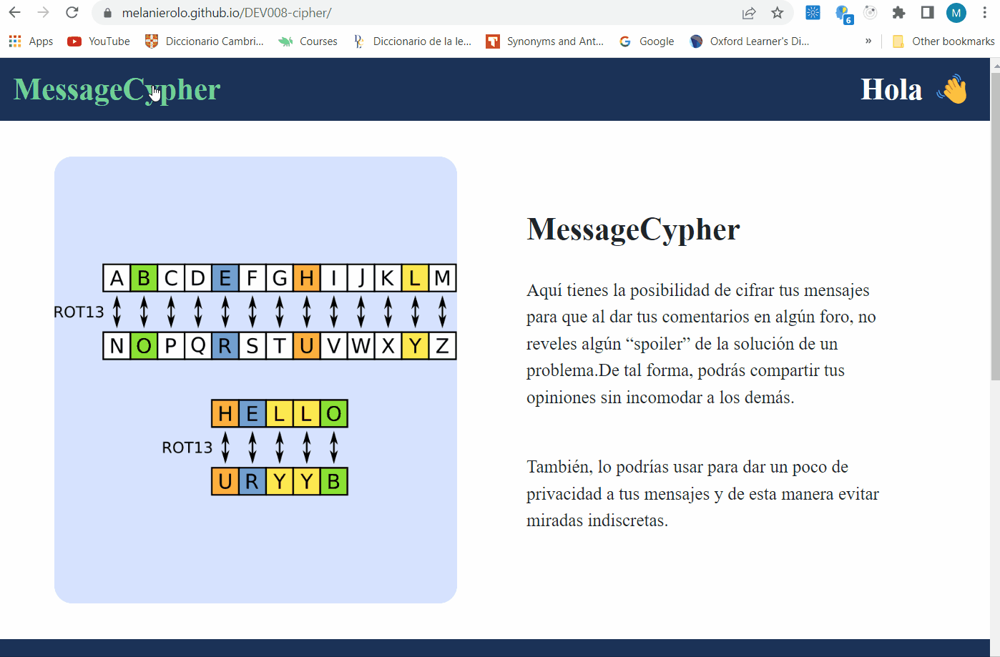

# MessageCypher

## Introducción

Este es un sitio web desarrollado en el bootcamp de Laboratoria. El objetivo principal de este proyecto
es el de brindar una herramienta para que el usuario pueda cifrar y descifrar el texto que ingresa en la página. Además,
el usuario debe ingresa un "número" para indicar el desplazamiento.

La técnica de cifrado que se utilizó es el "cifrado César", el cual se clasifica como un cifrado por sustitución y consiste en sustituir cada letra del abecedario por una letra desplazada un número determinado de posiciones(offset).

Por ejemplo,si usamos el desplazamiento de 5 posiciones:

- La letra A se cifra como F.
- La palabra MASCOTA se cifra como RFXHTYF.

## Misión

Este proyecto fue diseñado para que los usuarios tengan la posibilidad de cifrar sus mensajes y evitar revelar 'spoilers' de la solución de un problema al dar sus comentarios en algún foro, de manera que puedan compartir sus opiniones libremente y sin incomodar a los demás. Además, también es una herramienta útil para brindar privacidad a los mensajes que dejes en plataformas de mensajería y evitar miradas indiscretas.

## Objetivos

- Proporcionar una herramienta fácil y cómoda para cifrar mensajes.
- Brindar una herramienta que de un grado de seguridad para la comunicación entre amigos, familiares o colegas en plataformas de mensajería.

## Prototipo utilizando Figma

- Prototipo de alta fidelidad:

## Demo

## Instalación y consideraciones técnicas

Para descargar, instalar y ejecutar la aplicación debes seguir los siguientes pasos:

1. Realizar un 🍴fork del repositorio.
2. ⬇️clonar el repositorio (contiene la estructura de archivos,toda la configuración de dependencias y tests) a tu computadora(copia local) con el comando `git clone URL`.
3. 📦 Instala las dependencias del proyecto con el comando `npm install`. Esto asume que has instalado Node.js (que incluye npm). Además, puedes probar que tienes Node.js instalado con el comando `node --version` o `node -v`.
4. Si todo ha ido bien, deberías poder ejecutar las 🚥 pruebas unitarias (unit tests) con el comando `npm test`
5. Para ver la interfaz del programa en el navegador, usa el comando `npm start` para arrancar el servidor web y dirígete a `http://localhost:5000` en tu navegador.
